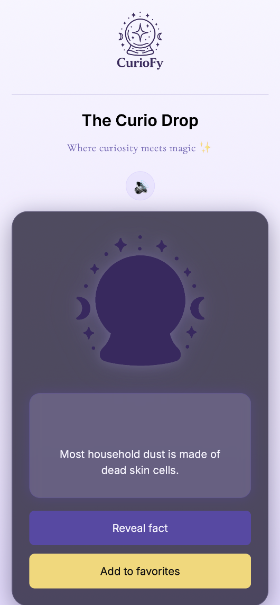
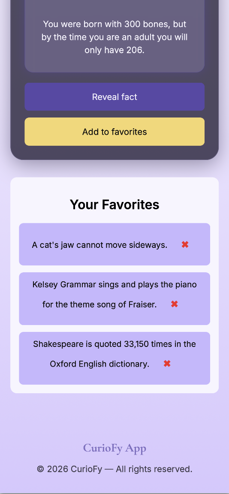

# 🔮 Curiofy

Curiofy is an interactive web app that delivers random facts in a playful and engaging way, combining curiosity with a mystical user experience.

---

## 📚 Table of Contents

- 💡 Project Overview
- 🖼 Screenshots
- 🛠 Tech Stack
- 🏗 Application Architecture
- 📋 Functional Requirements
- ⚙️ Running the Project Locally
- 🔎 Code Review Notes
- 🚀 Future Improvements
- ❓ FAQ
- 👩‍💻 Author

---

## 💡 Project Overview

Curiofy is a front-end application built with vanilla JavaScript that consumes a public API to display random facts.

The goal of this project is not only functionality, but also **user experience**, focusing on:

- Clean UI
- Interactive elements
- Smooth user feedback
- Lightweight architecture

It serves as both a **learning project** and a **portfolio piece** demonstrating DOM manipulation, API integration, and UI logic.

👉 Live Demo:  
https://lorenasferreira.github.io/curiofy/index.html

---

## 🖼 Screenshots

### 📱 App experience

<div align="center">
  
  
</div>

---

## 🛠 Tech Stack

- HTML5
- CSS3 (responsive design + animations)
- JavaScript (vanilla)
- Public API (Useless Facts API)

---

## 🏗 Application Architecture

The project follows a modular structure separating concerns:

```

/js
api.js        → handles API requests
ui.js         → handles DOM rendering
main.js       → app logic and event handling

```

Key concepts used:

- Separation of concerns
- Reusable functions
- State handling (favorites)
- Event-driven architecture

---

## 📋 Functional Requirements

- Fetch random facts from an external API
- Display facts dynamically in the UI
- Add facts to favorites
- Prevent duplicate favorites
- Render favorites list dynamically
- Show empty state when no favorites exist

---

## ⚙️ Running the Project Locally

Clone the repository:

```bash
git clone https://github.com/lorenasferreira/curiofy.git
```

Navigate into the project:

```bash
cd curiofy
```

Run the project:

Option 1:

- Open `index.html` in your browser

Option 2 (recommended):

```bash
npx live-server
```

---

## 🔎 Code Review Notes

- The project is built using **vanilla JavaScript**, without frameworks, to reinforce core concepts
- Functions are modular and focused on single responsibilities
- UI updates are handled dynamically via DOM manipulation
- Basic state management is implemented for favorites

---

## 🚀 Future Improvements

- Persist favorites using `localStorage`
- Add categories and filtering system
- Add loading states and UX feedback
- Implement share functionality
- Deploy improved version with custom domain

---

## ❓ FAQ

**Is this project using any framework?**
No. It is built with pure JavaScript to demonstrate core front-end skills.

**Can this project be extended?**
Yes. It is designed to be easily scalable and modular.

**Is this production-ready?**
Currently focused on learning and portfolio, but can be evolved into a full product.

---

## 👩‍💻 Author

Lorena Ferreira<br>
Full stack developer focused on building interactive and user-centered web experiences.<br>
This project was fully designed and developed independently.
